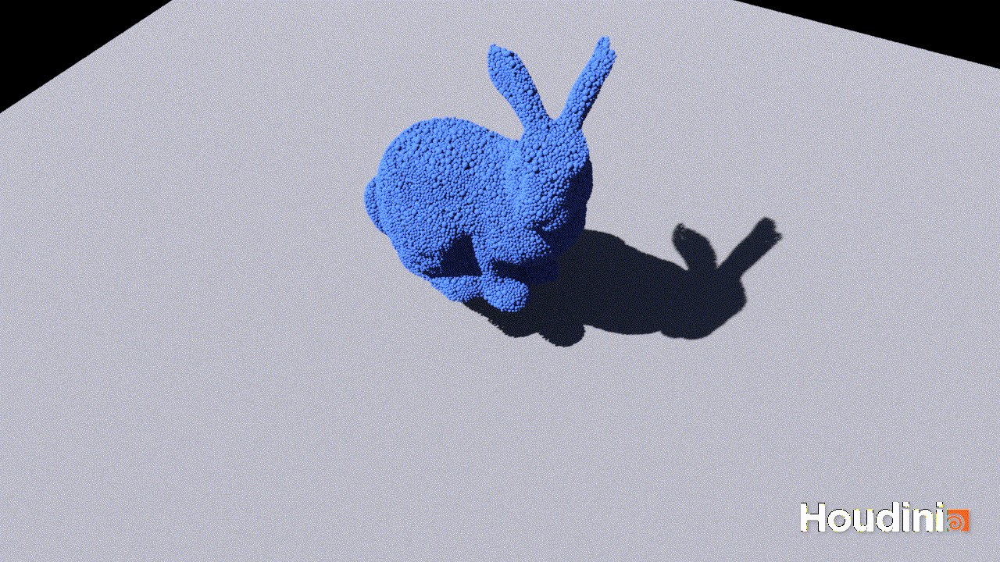

# Engineering quantitative DEM simulation using Taichi DEM

Won the 1st prize and most popular prize in Taichi DEM code optimization competition! See: https://forum.taichi-lang.cn/t/topic/2975 (in Chinese)

A complete implementation of DEM in Taichi Lang from engineering perspective.


>Visualized using BIMBase (TM) with secondary development. BIMBase (TM) is a graphical platform aimed for BIM developed by Beijing Glory PKPM Technology Co., Ltd. https://app.pkpm.cn/pbims




>Visualized using Houdini (TM). Houdini (TM) is an effect software with flexible workflows which are friendly to users. https://www.sidefx.com/products/houdini

## Authors
Denver Pilphis (Di Peng) - DEM theory and implementation

MuGdxy (Xinyu Lu) - Performance optimization

## Introducion
This instance provides a complete implementation of discrete element method (DEM) for simulation.
Complex DEM mechanics are considered and the result is engineering quantitative.
The efficiency of computation is guaranteed by Taichi, along with proper arrangements of data and algorithms.

To run the demo:

```bash
$ python dem.py
```

You may need to modify parameters before you run. See the comments in `dem.py`.

## Features
Compared with initial version, this instance has added the following features:

1.  2D DEM to 3D DEM;
2.  Particle orientation and rotation are fully considered and implemented, in which the possibility for modeling nonspherical particles is reserved;
3.  Wall (geometry in DEM) element is implemented, particle-wall contact is solved;
4.  Complex DEM contact model is implemented, including a bond model (Edinburgh Bonded Particle Model, EBPM) and a granular contact model (Hertz-Mindlin Contact Model);
5.  As a bond model is implemented, nonspherical particles can be simulated with bonded agglomerates;
6.  As a bond model is implemented, particle breakage can be simulated;
7.  Material properties are associated with particles / walls to reduce the space cost;
8.  Surface interaction properties are associated with contacts to reduce the space cost;
9.  Spatial hash table is implemented based on Morton code for neighboring search (broad phase collision
    detection);
10. Neighboring pairs are stored to reduce the divergence within the kernel and thus increase the efficiency of parallel computing, in which bit table and parallel scan algorithm are adopted for low and high workloads respectively;
11. Contacts are stored via the dynamic list linked to each particle to reduce the space cost, and the list is maintained (including appending and removing contacts) during every time step.

## Demos
### Carom billiards
This demo performs the first stage of carom billiards. The white ball goes towards other balls and collision
occurs soon. Then the balls scatter. Although there is energy loss, all the balls will never stop as they
enter the state of pure rotation and no rolling resistance is available to dissipate the rotational kinematic
energy. This could be a good example of validating Hertz-Mindlin model.


### Cubic bonded agglomerate with 911 particles impact on a flat surface
This demo performs a bonded agglomerate with cubed shape hitting on a flat surface.
The bonds within the agglomerate will fail while the agglomerate is hitting the surface.
Then the agglomerate will break into fragments, flying to the surrounding space.
This could be a good example of validating EBPM.


### Cubic bonded agglomerate with 18112 particles impact on a flat surface
This demo is similar to the one above, with the only difference of particle number.
This could be a good example of benchmark on large system simulation.


### Stanford bunny free fall
This demo contains a Stanford bunny shaped bonded agglomerate falling in gravity and hitting on the horizontal surface.
The breakage of the bunny is demonstrated.
This could be a good example of benchmark on large system simulation.


### Soft Stanford bunny free fall
This demo contains a Stanford bunny shaped bonded agglomerate falling
in gravity and hitting on the flat surface.
The bunny will not break as the strength of the bond is extremely high;
instead, the bunny will experience a very soft mechanical behavior
as the elastic modulus of the bond is relatively low.
This could be a good example of comparison to the demo above.


### Stanford bunny free fall (fast)
This demo is a fast version of Stanford bunny free fall for final testing in PKU HPC competition.


## Acknowledgements
Associate Prof. Xizhong Chen from School of Chemistry and Chemical Engineering,
Shanghai Jiao Tong University (https://scce.sjtu.edu.cn/teachers/3196.html, in Chinese) is acknowledged.
