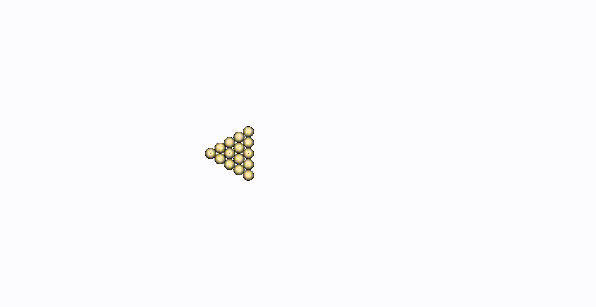
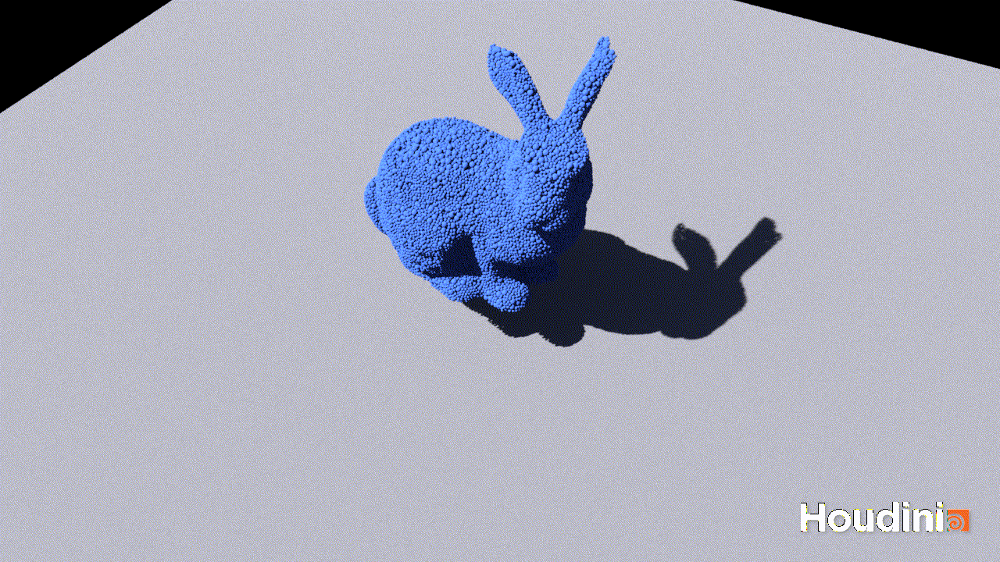

# 使用 Taichi DEM 进行工程定量离散单元法仿真

荣获 Taichi DEM 代码优化挑战赛第一名和最佳人气奖! 详见: https://forum.taichi-lang.cn/t/topic/2975

从工程角度使用 Taichi 语言完整实现离散单元法。

>使用 BIMBase (TM) 二次开发可视化。BIMBase (TM) 是北京构力科技有限公司研发的用于 BIM 的图形平台。https://app.pkpm.cn/pbims

>使用 Houdini (TM) 可视化。Houdini (TM) 是一款特效软件，工作流程灵活，对用户友好。https://www.sidefx.com/products/houdini

## 作者

Denver Pilphis (Di Peng) - 离散单元法理论与实现

MuGdxy (Xinyu Lu) - 性能优化

## 简介

本例提供一个完整的离散单元法 (DEM) 仿真的实现，考虑了复杂的 DEM 力学机制，仿真结果达到工程定量精度。

本例使用 Taichi 语言，加上适当的数据结构和算法，以保障计算效率。

## 新增功能

相比 Taichi DEM 原始版本，本例增加了如下功能：

1.  二维离散单元法→三维离散单元法；
2.  完整考虑并实现颗粒方位和旋转，预留了建模和仿真非球形颗粒的空间；
3.  实现了墙 (离散元中的边界) 单元，并实现了颗粒-墙接触解算；
4.  实现了复杂离散元接触模型，包括一个胶结模型 (爱丁堡胶结颗粒模型，EBPM) 和一个颗粒接触模型 (Hertz-Mindlin 接触模型)；
5.  因胶结模型已实现，可以使用胶结团块模拟非球形颗粒；
6.  因胶结模型已实现，可以仿真颗粒破碎过程；
7.  将材料特性与颗粒 / 墙体关联，以降低空间成本；
8.  将接触面交互属性与接触关联，以降低空间成本；
9.  基于 Morton 编码实现空间哈希表，进行邻接搜索 (宽碰撞检测)；
10. 分别对低工作负载和高工作负载采用位表和并行扫描算法，存储邻接对以减少内核内部的发散，从而提高并行计算效率；
11. 接触存储在每个颗粒所关联的动态列表中，以降低空间成本，列表在每个时间步都会维护 (处理接触的增减)。

## 示例

### 开仑台球

本例展示了开仑台球开局第一球。白球正对其他球运动并发生碰撞，然后球散开。虽然该过程中有能量损失，但是由于没有抗转动力学响应耗散转动动能，所有的球在进入纯滚动状态后将会一直滚动下去。本例可用于验证 Hertz-Mindlin 模型。

### 911 个颗粒胶结组成的立方体团块撞击平整表面

本例展示了一个立方体胶结团块撞击平整表面的过程。
撞击过程中，团块内部的胶结受力将发生破坏，然后团块碎成碎片，飞向周围空间。
本例可用于验证EBPM模型。

### 18112 个颗粒胶结组成的立方体团块撞击平整表面

本例与上例相似，唯独团块所含颗粒数不同。本例可用于大规模体系仿真的性能测试。

### 斯坦福兔子自由落体撞击水平表面

本例展示了一个斯坦福兔子形状的胶结团块自由落体撞击水平表面，然后破碎的过程。本例可用于大规模体系仿真的性能测试。

### 柔软的斯坦福兔子自由落体撞击水平表面

本例展示了一个斯坦福兔子形状的胶结团块自由落体撞击水平表面的过程。由于胶结强度极高，兔子不会破碎；相反，由于胶结弹性模量相对较低，兔子会表现出相当软的力学响应。本例可作为上例很好的对比。

### 斯坦福兔子自由落体撞击水平表面 (快速计算版)
本例为斯坦福兔子自由落体撞击水平表面的快速计算版。用于北京大学高性能计算综合能力竞赛最终测试。

## 致谢

感谢上海交通大学化学化工学院陈锡忠副教授 (https://scce.sjtu.edu.cn/teachers/3196.html) 对本研究给予的帮助和支持。
